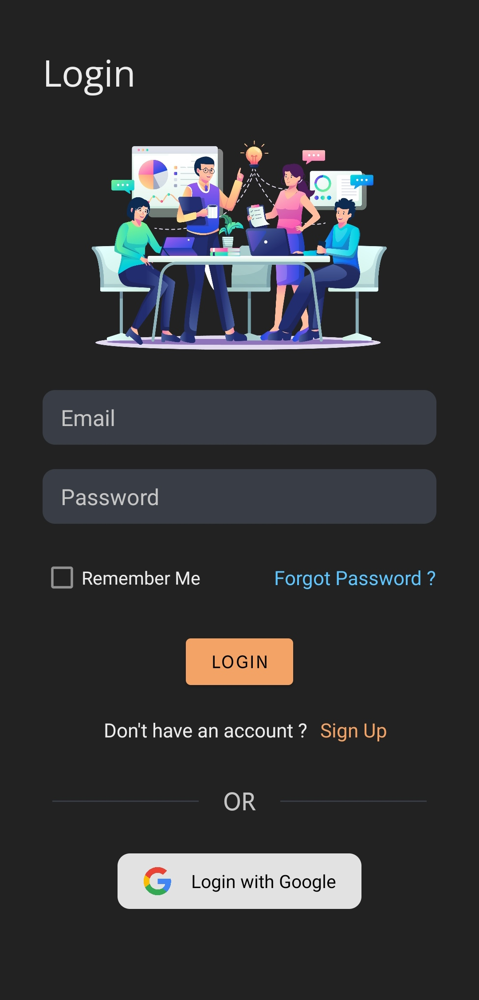
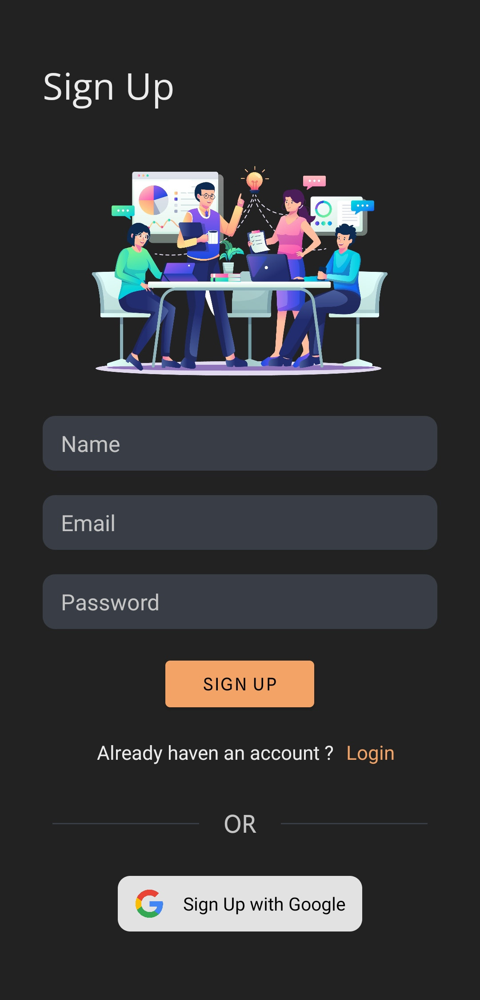
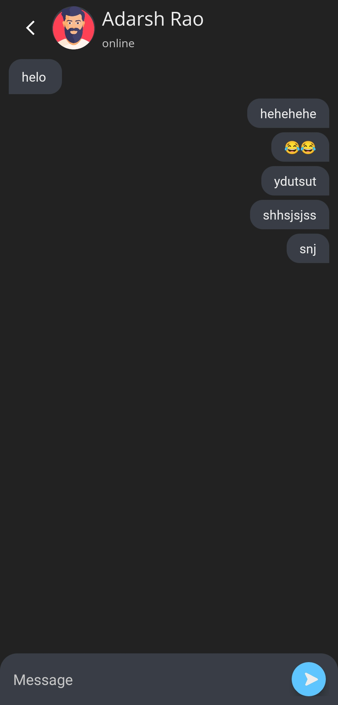

# Shit Chat

Shit Chat is a realtime chat application made with Kotlin.

	
	
	

## Screeshots :

|  |  |
|:---:|:---:|
| Login UI | Sign Up UI |

|  |  |
|:---:|:---:|
| User List UI | Chat UI |

## Features

 - Store Chat on Firebase
 - Login and Signup
 - Dark UI
 - Show all registered users

## More projects :

 - [Cocaine](https://github.com/vishal2376/Cocaine)
 - [Virtual Assistant](https://github.com/vishal2376/virtual-assistant)
 - [Telegram Bot](https://github.com/vishal2376/telegram-bot)

## Contacts :

 - [Instagram](https://www.instagram.com/vishal_2376/)
 - [Telegram](https://t.me/vishal2376/)
 - [Join Telegram group](https://t.me/cppwithtricks)
